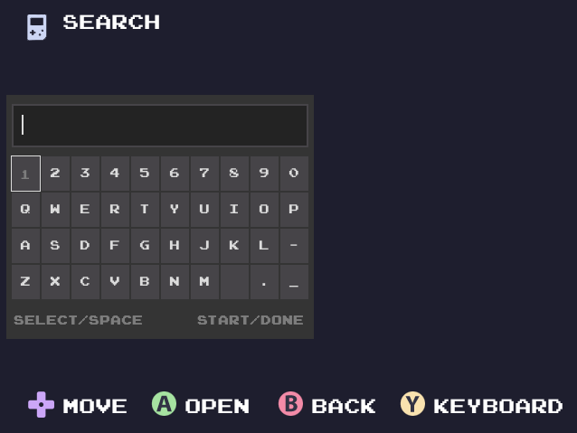
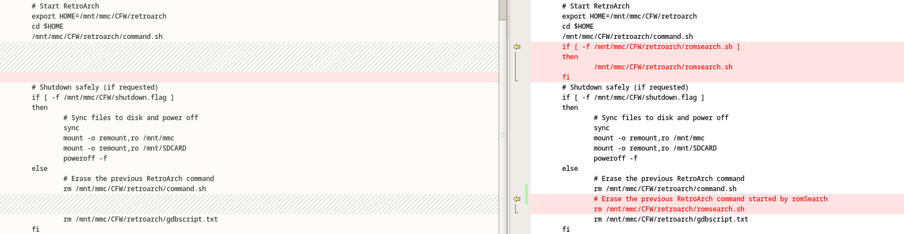

# ROM Search

ROM Search for Anbernic RG35XX (Garlic OS).



## Details

- ###  This software is provided as is! Please back up your card! I am not responsible for any data you may lose!
- This was created for personal use.
- Compiled for Garlic OS using  nfriedly / miyoo-toolchain
- The app shows the first 100 roms found that match the search pattern.  
- For mame roms  `"ARCADE", "CPS1", "CPS2", "CPS3", "FBNEO", "MAME2000", "NEOGEOCD", "NEOGEO"` the search is done based on mame.csv
- The app tries to follow the Garlic OS theme.
- The colors of the keyboard can be changed by adjusting `skin.json` file
- The app tries to find the need files in the CFW. If a file is missing or broken, the app will use the files in the resource folder.
- The app shoudl work in both single-sd and double-sd configuration! It will try to search for ROMs on both SD cards.

## Key Shortcuts
- When keyboard is showing
```
	A - Type key
	B - Backspace
	X - Swap  left/right
	Y - Hide Keyboard
	Select - Space
	Start - Enter/Hide keyboard
	Menu - Back to main menu
```
- When the keyboard is hidden
```
	A - Open ROM
	B - Back to main menu
	Y - Show keyboard
	Menu - Back to main menu
```

## Installation

- ##### Back up your `../CFW/start` file. The following changes will be performed 

- copy the folders to  the `Roms` partition
- in a dual card setup `CFW` folder must be copied to SD1 card and the `ROMS` folder can be copied to either SD1 or SD2.

## Technical details

- Before launching an app or a ROM via retroarch, Garic OS creates a file `command.sh` in the `../CFW/retroarch` folder.
- After the script is created, the main app closes and the script will be run
- This is done to free up the RAM allocated by the main app
- romSearch does a similar thing, creating the `romsearch.sh` at the same location
- I could not find a way to implement the same behaviour without changing the start script.
